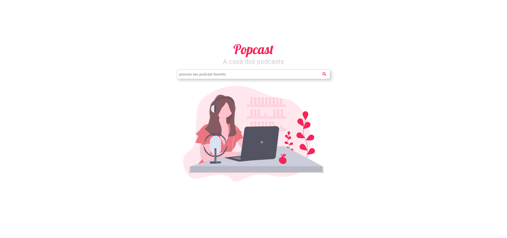
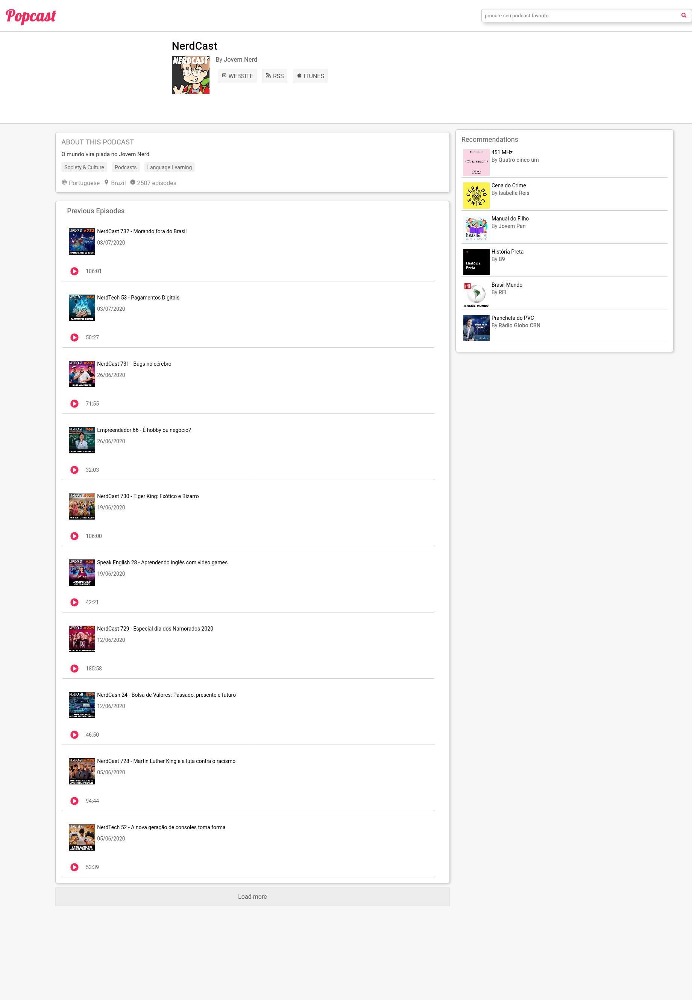
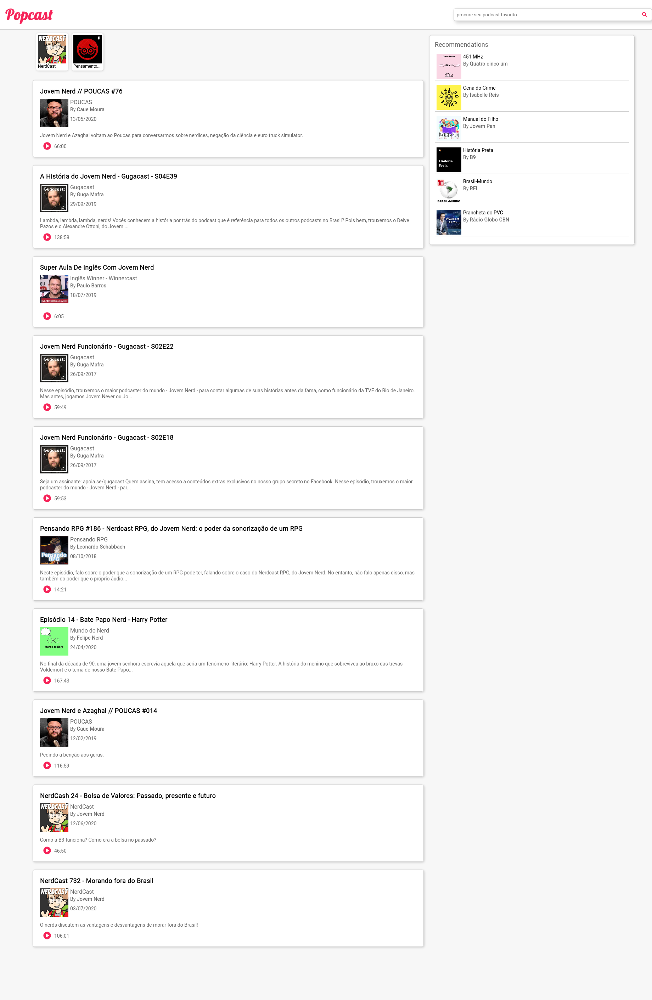

## Popcast

### `About`

Web app made with javascript, Redux and React

you can check the result [here](https://popcast.netlify.app/)

### `Api`

The api used for fetching data is the [Listennotes](https://www.listennotes.com/) api

